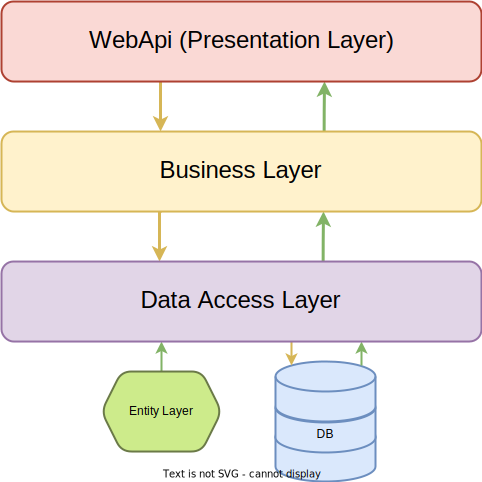
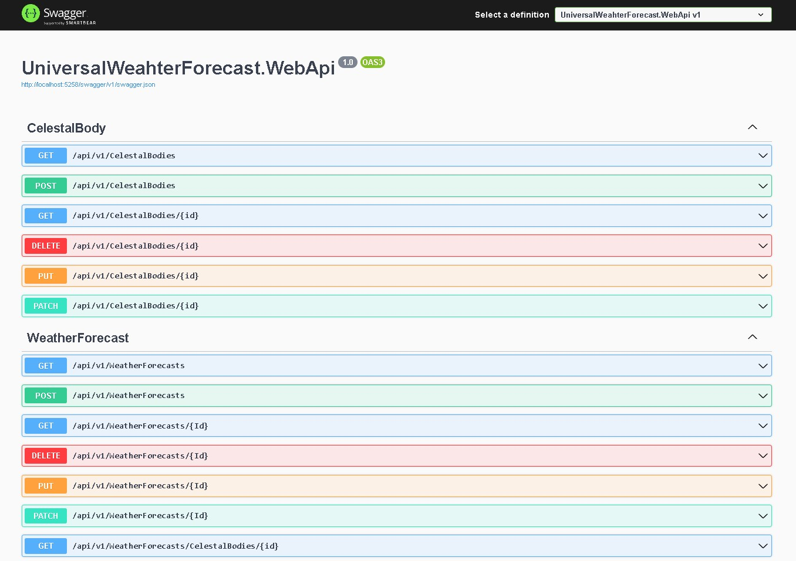

# Uzay Hava Durumu API


## Projede kullanılan paketler:

```
AutoMapper                                              Version=12.0.1
AutoMapper.Extensions.Microsoft.DependencyInjection     Version=12.0.1
FluentValidation                                        Version=11.8.1
Microsoft.AspNetCore.JsonPatch                          Version=8.0.0
Microsoft.AspNetCore.Mvc.NewtonsoftJson                 Version=7.0.14
Microsoft.AspNetCore.OpenApi                            Version=7.0.9
Microsoft.EntityFrameworkCore                           Version=7.0.14
Microsoft.EntityFrameworkCore.DynamicLinq               version=7.3.7
Microsoft.EntityFrameworkCore.Design                    Version=7.0.14
Microsoft.EntityFrameworkCore.InMemory                  Version=7.0.14
Microsoft.EntityFrameworkCore.Tools                     Version=7.0.14>
Microsoft.Extensions.DependencyInjection                Version=8.0.0
Swashbuckle.AspNetCore                                  Version=6.5.0
```
  
Bu API, kendi içerisinde oluşturulmuş olan hayali hava durumu bilgilerini sunar. Proje, ```N-Tier Architecture``` mimaride geliştirilmesi hedeflenmiş olup, görevler 3 katmana ayrıldı..  

Katmanlar ve görevleri:

| Katman Adı | Katman Görevi |
| :--------  | :------------ |
| EntityLayer | DB'de bulunan tabloları karşılayan entity'leri barındıran katmandır. |
| DataAccessLayer | DB operasyonlarının bulunduğu katmandır. Veri ekleme/silme/güncelleme/getirme işlemlerinin yapıldığı katmandır. |
| BusinessLayer | Verinin işlendiği katmandır. API'den gelen veriler entity'ye burada dönüştürülerek DAL'a iletilir. Aynı şekilde Get isteği yapıldığında da DAL'dan veriyi alıp işleyip API'ye teslim eder. |
| WebApi | Verilerin son kullanıcıya sunulduğu katmandır. Presenation Layer olarak da isimlendirilebilir. | 

Projede InMemory DB kullanıldı. Çalışma esnasında veri olması için hazır veriler oluşturuldu. DB işlemlerinin yönetilmesi için de ```EntityFrameWorkCore``` kütüphanesi ile ```linq``` sorguları kullanıldı. Filtreleme sorgularında dinamik bir yapı oluşturulmak istendiği için ```DynamicLinq``` kütüphanesi kullanıldı.

Katmanlar arası bağımlılıkarı yönetebilmek için ```DependencyInjection``` kütüphanesi kullanılarak WebApi katmanında bağımlılaklar bildirildi.

Gelen verilerin doğrulaması için de ```FluentValidation``` kütüphanesi kullanıldı. Genel proje şeması aşağıdaki verilen şekildeki gibidir:



SwaggerUI ekran görüntüsü:


# API'nin Kullanımı

## WeatherForecats endpoint'i:

### GetList:

```
  GET /api/v1/WeatherForecasts?={QueryString}
```
DB'de kayıtlı olan hava tahmini kayıtlarından geri döndüren endpoint'tir. Varsayılan olarak tüm kayıt döndürür. Sorgu başarılı olursa 200 Ok durum kodu döndürür. Bir hata ile karşılaşılırsa (veri bulunanaması gibi) 400 BadRequest durum kodu döndürür.

**QueryString ile aşağıda verilen opsiyonel seçenekler eklenebilir:**

##### Tarih aralığı filtreleme 

Verilen tarih aralığına göre tüm kayıtları döndürür. QueryString'de verilecek parametreler aşağıdaki gibidir. 

| Parametre | Tip     | Açıklama                |
| :-------- | :------- | :------------------------- |
| `start_date` | `string` | Başlangıç tarihi. |
| `end_date` | `string` | Bitiş tarihi. |

Parametreler tek başına olarak da verilemez. "start_date", "end_date"'den önce verilmelidir.

##### Sıralama filtresi

Verilerin hangi property'e göre nasıl sıralanması isteniyorsa sıralı şekilde ',' (virgül) ile birleştirilerek verilmelidir. virgül sonrası girilen bilgi "desc" olmadığı sürece varsayılan olarak "asc" sıralama yapar. Birden fazla sıralama ölçütü verilebilir. Sıralama işleminde ilk verilen parametreye göre ilk, son verilen parametreye göre son sıralama yapılır.

| Parametre | Tip     | Açıklama                |
| :-------- | :------- | :------------------------- |
| `Sort ` | `string` | Sıralama ölçütü(Örn. Sort=id,desc). |


##### Gökcismi filtrelemesi

Gelen verilerde olması istenilmeyen gökcismi ID'leri var ise bu parametrede belirtilir. Birden fazla gökcismi ID'si verilebilir

| Parametre | Tip     | Açıklama                |
| :-------- | :------- | :------------------------- |
| `delisting ` | `int` | Çıkarılmak istenen gökcismi ID'si. |

Örnek bir QueryString ile oluşturulmuş ```GET``` isteği:
```
GET /api/v1/WeatherForecasts?StartDate=12.1.2023&EndDate=12.8.2023&Sort=bodyid,desc&DelistingIds=1&DelistingIds=5
```

Dönen verinin property tablosu:
| Property | Tip     | Açıklama                |
| :-------- | :------- | :------------------------- |
| `ID ` | `int` | Kayıt ID'si |
| `BodyId ` | `int` | Gök cismi Id'si. |
| `BodyName ` | `DateTime` | Gök cismi adı. |
| `TypeName ` | `DateTime` | Hava tahmini türü. |
| `Temprature ` | `int` | Sıcaklık tahmini. |
| `WeatherTime ` | `string` | Tahmin edilen tarih. |

---

### GetById

```
GET /api/v1/WeatherForecasts/{id}
```
DB'de kayıtlı hava tahmini kayıtlarından sadece kayıt ID'sine göre veri döndüren endpoint'tir. Parametre olarak "/{id}" alır. Sorgu başarılı olursa 200 Ok durum kodu döndürür. Bir hata ile karşılaşılırsa (veri bulunanaması gibi) 400 BadRequest durum kodu döndürür.

Başarılı sorgu sonucu dönen veri GetList isteği ile aynıdır.

---

```
GET /api/v1/WeatherForecasts/CelestialBodies/{id:int}?{QueryString}
```

DB'de kayıtlı hava tahmini kayırlarından sadece belirtilen gök cismi ID'sine ait kayıtları döndüren endpoint'tir. {id:int} gök cismi Id'sini tanımlar. Sorgu başarılı olursa 200 Ok durum kodu döndürür. Bir hata ile karşılaşılırsa (veri bulunanaması gibi) 400 BadRequest durum kodu döndürür.

  QueryString yapısı ile filtreleme yapılabilir. Querystring yapısı "GET> /WeatherForecasts?={QueryString}" yapısıyla aynıdır. Sadece "Listeden gökcismi çıkartma" filtresi bulunmamaktadır. 
  
**QueryString ile aşağıda verilen opsiyonel seçenekler eklenebilir:**

##### Tarih aralığı filtreleme 

Verilen tarih aralığına göre tüm kayıtları döndürür. QueryString'de verilecek parametreler aşağıdaki gibidir. 

| Parametre | Tip     | Açıklama                |
| :-------- | :------- | :------------------------- |
| `start_date` | `string` | Başlangıç tarihi. |
| `end_date` | `string` | Bitiş tarihi. |

Parametreler tek başına olarak da verilemez. "start_date", "end_date"'den önce verilmelidir.

##### Sıralama filtresi

Verilerin hangi property'e göre nasıl sıralanması isteniyorsa sıralı şekilde ',' (virgül) ile birleştirilerek verilmelidir. virgül sonrası girilen bilgi "desc" olmadığı sürece varsayılan olarak "asc" sıralama yapar. Birden fazla sıralama ölçütü verilebilir. Sıralama işleminde ilk verilen parametreye göre ilk, son verilen parametreye göre son sıralama yapılır.

| Parametre | Tip     | Açıklama                |
| :-------- | :------- | :------------------------- |
| `Sort ` | `string` | Sıralama ölçütü(Örn. Sort=id,desc). |

---

### Delete

```
DELETE /api/v1/WeatherForecasts/{id}
```
DB'den kayıt silmek için bu endpoint'e delete isteği gönderilmelidir. Parametre olarak gönderilen ID'ye ait kayıt varsa kaydı silip 204 NoContent durum kodunu döndürür. ID'ye ait kayıt yoksa 400 BadRequest durum kodunu döndürür.

---

### Post

```
POST /api/v1/WeatherForecasts
```
DB'ye veri kaydetmek için bu endpoint'e post isteği gönderilmelidir. İstek gövdesinde aşağıda verilen property'lerden oluşan bir nesne gönderilmelidir. Kayıt işlemi başarılı olursa 201 Created durum kodu döndürür. Gelen verinin hatalı olması durumunda 400 BadRequest durum kodu döndürür.

 Gönderilmesi gereken nesneye ait property tablosu: 

| Property | Tip     | Açıklama                |
| :-------- | :------- | :------------------------- |
| `BodyId ` | `int` | Gök cismi Id'si. |
| `TypeId ` | `int` | Hava tipi Id'si. |
| `Temprature ` | `int` | Sıcaklık tahmini. |
| `WeatherTime ` | `string` | Tahmin edilen tarih. |

---

### Put

```
PUT /api/v1/WeatherForecasts/{id}
```
DB'de bulunan bir veriyi güncellemek için bu endpoint'e istek gönderilmelidir. İstek gövdesinde aşağıda verilen property'lerden oluşan bir nesne gönderilmelidir. Bu metotla kayıt tarihi güncellemesi yapılamamaktadır. Güncelleme işlemi başarılı olması durumunda 200 Ok durum kodunu döndürür. Hatalı veri gelmesi durumunda 400 BadRequest durum kodu döndürür.

 Gönderilmesi gereken nesneye ait property tablosu: 

| Property | Tip     | Açıklama                |
| :-------- | :------- | :------------------------- |
| `BodyId ` | `int` | Gök cismi Id'si. |
| `TypeId ` | `int` | Hava tipi Id'si. |
| `Temprature ` | `int` | Sıcaklık tahmini. |

---

### Patch

```
PATCH /api/v1/WeatherForecasts/{id}
```
DB'de bulunan bir veriyi güncellemek için bu endpoint'e istek gönderilmelidir. Az sayıda property güncellemesinde kullanılması uygundur. İstek gövdesinde aşağıda verilen property'lere müdahale edilen JsonPatchDocument türünde bir nesne gönderilmelidir. Bu metotla kayıt tarihi güncellemesi yapılamamaktadır. Güncelleme işlemi başarılı olması durumunda 200 Ok durum kodunu döndürür. Hatalı veri gelmesi durumunda 400 BadRequest durum kodu döndürür.

 Gönderilmesi gereken nesneye ait property tablosu: 

| Property | Tip     | Açıklama                |
| :-------- | :------- | :------------------------- |
| `BodyId ` | `int` | Gök cismi Id'si. |
| `TypeId ` | `int` | Hava tipi Id'si. |
| `Temprature ` | `int` | Sıcaklık tahmini. |
| `WeatherTime ` | `string` | Tahmin edilen tarih. |


Örnek bir patch isteğinde gönderilecek JSON data:

```
[
  {
    "operationType": 0,
    "path": "string",
    "op": "string",
    "from": "string",
    "value": "string"
  }
]
```
---

## CelestialBodies endpoint'i:

### GetList:

```
  GET /api/v1/CelestialBodies?={QueryString}
```
DB'de kayıtlı olan hava tahmini kayıtlarından geri döndüren endpoint'tir. Varsayılan olarak tüm kayıt döndürür. Sorgu başarılı olursa 200 Ok durum kodu döndürür. Bir hata ile karşılaşılırsa (veri bulunanaması gibi) 400 BadRequest durum kodu döndürür.

**QueryString ile aşağıda verilen opsiyonel seçenekler eklenebilir:**

##### Gezegen/Uydu filtreleme

Gelen verilerden sadece gezegenleri veya uyduları seçmek istenirse bu yapı kullanılır.

| Parametre | Tip     | Açıklama                |
| :-------- | :------- | :------------------------- |
| `celestalbodytype` | `string` | Hangi türün döndürülmesi gerektiğin belirten paramtre <br> (Gezgenler için "planet", uydular için "satellite"). |


##### Sıralama filtresi

Verilerin hangi property'e göre nasıl sıralanması isteniyorsa sıralı şekilde ',' (virgül) ile birleştirilerek verilmelidir. virgül sonrası girilen bilgi "desc" olmadığı sürece varsayılan olarak "asc" sıralama yapar. Birden fazla sıralama ölçütü verilebilir. Sıralama işleminde ilk verilen parametreye göre ilk, son verilen parametreye göre son sıralama yapılır.

| Parametre | Tip     | Açıklama                |
| :-------- | :------- | :------------------------- |
| `Sort ` | `string` | Sıralama ölçütü(Örn. Sort=id,desc). |

Örnek bir QueryString ile oluşturulmuş ```GET``` isteği:
```
GET api/v1/CelestalBodies?CelestalBodyType=planet&SortingCriterion=name,desc
```

Dönen verinin property tablosu:
| Property | Tip     | Açıklama                |
| :-------- | :------- | :------------------------- |
| `ID ` | `int` | Kayıt ID'si |
| `Name ` | `DateTime` | Gök cismi adı. |
| `CelestalBodyType ` | `DateTime` | Gök cismi türü. |
| `AssociatedCelestalBody ` | `int` | Gök cisminin ilişkili olduğu diğer gök cisimleri. (=0 : gezegen olduğunu belirtir bir ilişki yoktur. >1 kayıt uyduysa hangi ID'li gezegenin uydusu olduğunu belirtir.) |

---

### GetById

```
GET /api/v1/CelestalBodies/{id}
```
DB'de kayıtlı gök cisimlerinden sadece kayıt ID'sine göre veri döndüren endpoint'tir. Parametre olarak "/{id}" alır. Sorgu başarılı olursa 200 Ok durum kodu döndürür. Bir hata ile karşılaşılırsa (veri bulunanaması gibi) 400 BadRequest durum kodu döndürür.

Başarılı sorgu sonucu dönen veri GetList isteği ile aynıdır.

---

### Delete

```
DELETE /api/v1/CelestalBodies/{id}
```
DB'den kayıt silmek için bu endpoint'e delete isteği gönderilmelidir. Parametre olarak gönderilen ID'ye ait kayıt varsa kaydı silip 204 NoContent durum kodunu döndürür. ID'ye ait kayıt yoksa 400 BadRequest durum kodunu döndürür.

---

### Post

```
POST /api/v1/CelestalBodies
```
DB'ye veri kaydetmek için bu endpoint'e post isteği gönderilmelidir. İstek gövdesinde aşağıda verilen property'lerden oluşan bir nesne gönderilmelidir. Kayıt işlemi başarılı olursa 201 Created durum kodu döndürür. Gelen verinin hatalı olması durumunda 400 BadRequest durum kodu döndürür.

 Gönderilmesi gereken nesneye ait property tablosu: 

| Property | Tip     | Açıklama                |
| :-------- | :------- | :------------------------- |
| `Name ` | `string` | Gök cismi adı. |
| `IsPlanet ` | `string` | Gök cismi türü. |
| `AssociatedCelestalBody ` | `int` | Gök cisminin ilişkili olduğu ID. |

---

### Put

```
PUT /api/v1/CelestalBodies/{id}
```
DB'de bulunan bir veriyi güncellemek için bu endpoint'e istek gönderilmelidir. İstek gövdesinde aşağıda verilen property'lerden oluşan bir nesne gönderilmelidir. Bu metotla kayıt tarihi güncellemesi yapılamamaktadır. Güncelleme işlemi başarılı olması durumunda 200 Ok durum kodunu döndürür. Hatalı veri gelmesi durumunda 400 BadRequest durum kodu döndürür.

 Gönderilmesi gereken nesneye ait property tablosu: 

| Property | Tip     | Açıklama                |
| :-------- | :------- | :------------------------- |
| `Name ` | `string` | Gök cismi adı. |
| `IsPlanet ` | `string` | Gök cismi türü. |
| `AssociatedCelestalBody ` | `int` | Gök cisminin ilişkili olduğu ID. |

---

### Patch

```
PATCH /api/v1/CelestalBodies/{id}
```
DB'de bulunan bir veriyi güncellemek için bu endpoint'e istek gönderilmelidir. Az sayıda property güncellemesinde kullanılması uygundur. İstek gövdesinde aşağıda verilen property'lere müdahale edilen JsonPatchDocument türünde bir nesne gönderilmelidir. Bu metotla kayıt tarihi güncellemesi yapılamamaktadır. Güncelleme işlemi başarılı olması durumunda 200 Ok durum kodunu döndürür. Hatalı veri gelmesi durumunda 400 BadRequest durum kodu döndürür.

 Gönderilmesi gereken nesneye ait property tablosu: 

| Property | Tip     | Açıklama                |
| :-------- | :------- | :------------------------- |
| `Name ` | `string` | Gök cismi adı. |
| `IsPlanet ` | `bool` | Gök cismi türü. |
| `AssociatedCelestalBody ` | `int` | Gök cisminin ilişkili olduğu ID. |


Örnek bir patch isteğinde gönderilecek JSON data:

```
[
  {
    "operationType": 0,
    "path": "string",
    "op": "string",
    "from": "string",
    "value": "string"
  }
]
```
---